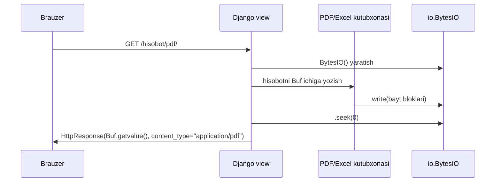

# 6.1. `io.BytesIO`/`StringIO` — xotirada fayl yaratib to'g'ridan-to'g'ri yuborish

## Bu darsda nimalarni o'rganasiz

- `io.BytesIO` — diskka yozmasdan, xotirada "fayl kabi" obyekt yaratishni o'rganasiz
- Buni PDF, Excel, rasm kabi generatsiya qilinadigan fayllarni to'g'ridan-to'g'ri `HttpResponse` orqali yuborishda qo'llashni bilib olasiz
- `StringIO`ning `BytesIO`dan farqini (matn vs bayt) tushunasiz
- So'rov-javob (request-response) oqimini diagramma orqali ko'rasiz

## Nazariy qism

### Nega xotirada fayl kerak

Ba'zan fayl (masalan hisobot, chek, QR-kod) foydalanuvchi so'rov yuborgan **paytda**, dinamik ravishda yaratiladi — uni doimiy saqlash shart emas, faqat bir martalik yuklab olish uchun kerak. Bunday holda diskka vaqtinchalik fayl yozib, keyin uni o'qib, keyin o'chirish — ortiqcha, sekin va xatoga moyil (masalan o'chirishni "unutish" fayllarni to'plab qoladi). `io.BytesIO` — **xotirada**, diskka tegmasdan, xuddi fayl kabi ishlaydigan obyekt yaratadi:

```python
import io

buffer = io.BytesIO()
buffer.write(b"Salom, bu xotiradagi \"fayl\"")
buffer.seek(0)              # o'qishni boshidan boshlash uchun "kursorni" boshiga qaytarish
print(buffer.read())        # b'Salom, bu xotiradagi "fayl"'
```

`BytesIO` — `open("fayl.bin", "rb")` natijasi bilan bir xil interfeysga ega (`.write()`, `.read()`, `.seek()`), shuning uchun disk fayli kutayotgan har qanday kutubxona (masalan PDF yoki Excel generatorlari) `BytesIO`ni ham qabul qiladi — u "buni haqiqiy fayl deb" ishlatadi.

### `BytesIO` va `StringIO`

| | `BytesIO` | `StringIO` |
|---|---|---|
| Ma'lumot turi | bayt (`bytes`) | matn (`str`) |
| Qachon ishlatiladi | rasm, PDF, Excel, arxiv — ikkilik formatlar | CSV, matnli hisobot — matnli formatlar |

```python
import io

matn_buffer = io.StringIO()
matn_buffer.write("Nomi,Narxi\n")
matn_buffer.write("Krossovka,450000\n")
print(matn_buffer.getvalue())   # to'liq matnni qaytaradi (seek/read shart emas)
```

4.2-darsdagi `csv.writer(response)` aslida shu g'oyaga o'xshaydi — `HttpResponse` o'zi matn/bayt yozib bo'ladigan obyekt, `StringIO`/`BytesIO` esa xuddi shunday, faqat **xotirada**, hali hech qayerga yuborilmagan holatda.

### So'rov-javob oqimi

Xotirada fayl generatsiya qilishning butun jarayoni — so'rovdan javobgacha — quyidagicha ko'rinadi:



Diqqat qiling: hech qanday fayl diskka yozilmadi — hammasi xotirada, so'rov davomida yaratilib, javob sifatida to'g'ridan-to'g'ri yuborildi.

## Amaliy misol

`onlayn_dokon`da mijoz o'z buyurtmasi uchun oddiy matnli "chek" (`.txt`) yuklab olishi mumkin bo'lgan view yozamiz — bu real PDF kutubxonasisiz ham `io`ning g'oyasini to'liq ko'rsatadi (PDF/Excel generatsiyasi uchun 4-qismda ko'rilgan kabi tashqi kutubxona — masalan `reportlab` yoki `openpyxl` — kerak bo'ladi, lekin ular ham aynan shu `BytesIO` bilan ishlaydi):

```python
# apps/buyurtmalar/views.py
import io

from django.http import HttpResponse
from django.shortcuts import get_object_or_404

from .models import Buyurtma


def chekni_yuklab_olish(request, tashqi_id):
    buyurtma = get_object_or_404(Buyurtma, tashqi_id=tashqi_id)

    buffer = io.StringIO()
    buffer.write("=" * 40 + "\n")
    buffer.write("ONLAYN DO'KON — CHEK\n")
    buffer.write("=" * 40 + "\n")
    buffer.write(f"Buyurtma: #{buyurtma.tashqi_id}\n")
    buffer.write(f"Mijoz: {buyurtma.mijoz.toliq_ism}\n")
    buffer.write(f"Sana: {buyurtma.yaratilgan_sana.strftime('%Y-%m-%d %H:%M')}\n")
    buffer.write("-" * 40 + "\n")

    for element in buyurtma.elementlar.all():
        buffer.write(f"{element.mahsulot.nomi:<25} {element.miqdor} x {element.narx}\n")

    buffer.write("-" * 40 + "\n")
    buffer.write(f"JAMI: {buyurtma.umumiy_summa} so'm\n")

    response = HttpResponse(buffer.getvalue(), content_type="text/plain; charset=utf-8")
    response["Content-Disposition"] = f'attachment; filename="chek-{buyurtma.tashqi_id}.txt"'
    return response
```

Agar haqiqiy PDF kerak bo'lsa (masalan `reportlab` kutubxonasi bilan), tuzilma **aynan shu** qoladi, faqat `StringIO` o'rniga `BytesIO`, va matn yozish o'rniga kutubxonaning o'z chizish metodlari ishlatiladi:

```python
import io

from reportlab.pdfgen import canvas


def chek_pdf(request, tashqi_id):
    buyurtma = get_object_or_404(Buyurtma, tashqi_id=tashqi_id)

    buffer = io.BytesIO()
    pdf = canvas.Canvas(buffer)
    pdf.drawString(100, 800, f"Buyurtma #{buyurtma.tashqi_id}")
    pdf.drawString(100, 780, f"Jami: {buyurtma.umumiy_summa} so'm")
    pdf.save()

    buffer.seek(0)
    response = HttpResponse(buffer.getvalue(), content_type="application/pdf")
    response["Content-Disposition"] = f'attachment; filename="chek-{buyurtma.tashqi_id}.pdf"'
    return response
```

`canvas.Canvas(buffer)` — `reportlab`ga faylning **o'rniga** `BytesIO` obyektini uzatadi; kutubxona buni oddiy fayl deb hisoblab, hammasini xotiraga "yozadi". `pdf.save()`dan keyin `buffer.seek(0)` shart — chunki yozish tugagach, "kursor" faylning oxirida turadi, o'qishdan oldin uni boshiga qaytarish kerak.

## Keng tarqalgan xatolar

**Xato 1:** `.seek(0)`ni unutish.

❌ Kutubxona bilan `buffer`ga yozib bo'lgach, to'g'ridan-to'g'ri `buffer.read()` yoki `buffer.getvalue()` chaqirish o'rniga, `.seek(0)`siz `buffer.read()` chaqirish — bo'sh natija (`b""`) qaytarishi mumkin, chunki "kursor" allaqachon oxirda.

✅ Yozishdan keyin, o'qishdan (yoki `HttpResponse`ga uzatishdan) oldin har doim `buffer.seek(0)` chaqiring. Eslatma: `.getvalue()` bu muammoga duch kelmaydi (u kursor holatidan qat'iy nazar butun tarkibni qaytaradi) — shuning uchun ko'p hollarda `.getvalue()` `.seek(0)` + `.read()`dan qulayroq.

**Xato 2:** `BytesIO`ga `str` yoki `StringIO`ga `bytes` yozishga urinish.

❌ `io.BytesIO().write("matn")` — `TypeError: a bytes-like object is required, not 'str'` beradi.

✅ `BytesIO`ga faqat bayt yozing: `buffer.write("matn".encode())` yoki dastlab `StringIO` ishlating, keyin kerak bo'lsa `.getvalue().encode()` bilan baytga aylantiring.

**Xato 3:** Katta hisobotlarni to'liq xotirada yig'ib, keyin yuborish — juda katta hajmda muammo tug'diradi.

❌ 500 000 qatorli CSV hisobotni butunlay `StringIO`da yig'ib, keyin `HttpResponse`ga uzatish — bu ancha xotira talab qiladi va foydalanuvchi javobni faqat **hammasi tayyor bo'lgandan keyin** olishni boshlaydi (uzoq kutish).

✅ Juda katta hisobotlar uchun Django'ning `StreamingHttpResponse`idan foydalaning — u ma'lumotni bo'lak-bo'lak, generator orqali, xotiraga to'liq yig'masdan yuboradi. Kichik-o'rta hajmdagi (bir necha ming qator) hisobotlar uchun esa `BytesIO`/`StringIO` + oddiy `HttpResponse` yetarli va soddaroq.

## Mashq/topshiriq

**(Oson)** Shell'da `import io; b = io.BytesIO(); b.write(b"salom"); b.seek(0); print(b.read())` bajaring, so'ng `.seek(0)`siz ikkinchi marta `b.read()` chaqirib, bo'sh natija chiqishini kuzating.

**(O'rtacha)** `chekni_yuklab_olish` view'iga, agar buyurtmada hech qanday element bo'lmasa (`buyurtma.elementlar.all()` bo'sh bo'lsa), `"Bu buyurtmada mahsulot yo'q"` qatorini chek matniga qo'shadigan shart qo'shing.

**(Qiyin)** `onlayn_dokon` uchun barcha mijozlarning email manzillarini o'z ichiga olgan, `BytesIO` orqali generatsiya qilinadigan **ZIP** fayl yarating — ichida ikkita fayl bo'lsin: `mijozlar.csv` (4.2-darsdagi `csv` moduli bilan) va `hisobot.txt` (oddiy matn). `zipfile.ZipFile(buffer, "w")` va `.writestr(nom, tarkib)` metodlaridan foydalaning (standart kutubxonaning yana bir moduli — `zipfile`, `io` bilan bir xil g'oyada ishlaydi).

<details>
<summary>Javoblarni ko'rish</summary>

1.
```python
>>> import io
>>> b = io.BytesIO()
>>> b.write(b"salom")
5
>>> b.seek(0)
0
>>> b.read()
b'salom'
>>> b.read()
b''
```
Ikkinchi `read()` bo'sh, chunki birinchi `read()`dan keyin "kursor" faylning oxiriga o'tgan — yana o'qish uchun yana `seek(0)` kerak bo'ladi.

2.
```python
buffer.write("-" * 40 + "\n")

if not buyurtma.elementlar.exists():
    buffer.write("Bu buyurtmada mahsulot yo'q\n")
else:
    for element in buyurtma.elementlar.all():
        buffer.write(f"{element.mahsulot.nomi:<25} {element.miqdor} x {element.narx}\n")
```

3.
```python
import csv
import io
import zipfile

from django.http import HttpResponse

from apps.mijozlar.models import Mijoz


def mijozlar_zip_hisobot(request):
    buffer = io.BytesIO()

    with zipfile.ZipFile(buffer, "w") as zip_fayl:
        csv_buffer = io.StringIO()
        writer = csv.writer(csv_buffer)
        writer.writerow(["Ism", "Email"])
        for mijoz in Mijoz.objects.all():
            writer.writerow([mijoz.toliq_ism, mijoz.email])
        zip_fayl.writestr("mijozlar.csv", csv_buffer.getvalue())

        zip_fayl.writestr("hisobot.txt", f"Jami mijozlar: {Mijoz.objects.count()}")

    buffer.seek(0)
    response = HttpResponse(buffer.getvalue(), content_type="application/zip")
    response["Content-Disposition"] = 'attachment; filename="mijozlar-hisobot.zip"'
    return response
```

</details>

## Qisqacha xulosa

`io.BytesIO` va `io.StringIO` — diskka tegmasdan, xotirada fayl kabi ishlaydigan obyektlar yaratadi (`.write()`, `.read()`, `.seek()`, `.getvalue()`); PDF, Excel yoki ZIP kabi generatsiya qilinadigan fayllarni to'g'ridan-to'g'ri `HttpResponse` orqali yuborish uchun ideal, chunki vaqtinchalik disk fayli yaratish va o'chirishga hojat qoldirmaydi. Yozishdan keyin o'qishdan oldin `.seek(0)` chaqirishni unutmaslik, va `BytesIO`/`StringIO` mos ma'lumot turini (bayt yoki matn) qabul qilishini yodda tutish kerak — juda katta hisobotlarda esa `StreamingHttpResponse` ko'proq mos keladi. Keyingi darsda — bu safar **disk**dagi vaqtinchalik fayllar (`tempfile`) va fayl amallari (`shutil`) bilan tanishamiz.
