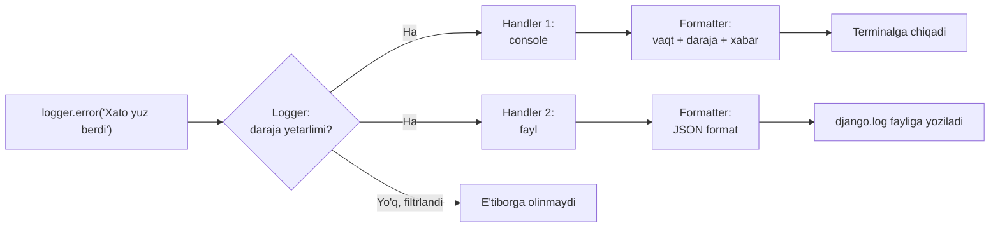

# 7.1. `logging` moduli — Django'ning `LOGGING` sozlamasi ostida nima yotadi

## Bu darsda nimalarni o'rganasiz

- `logging` modulining asosiy tushunchalarini — `Logger`, `Handler`, `Formatter`, daraja (level) — tushunasiz
- Nega `print()` o'rniga production kodda `logging` ishlatilishini asoslay olasiz
- Django'ning `settings.py`dagi `LOGGING` dictionary'sini o'qiy va o'zgartira olasiz
- View va management command ichida o'z logger'ingizni to'g'ri ishlatishni o'rganasiz
- Log yozuvining handler orqali qayerga borishini diagramma orqali ko'rasiz

## Nazariy qism

### `logging` asoslari

`logging` moduli — dastur ishlash jarayonida sodir bo'layotgan hodisalar haqida **darajalangan** xabarlar yozish uchun standart vosita:

```python
import logging

logger = logging.getLogger(__name__)

logger.debug("Batafsil diagnostika ma'lumoti")
logger.info("Oddiy hodisa: foydalanuvchi tizimga kirdi")
logger.warning("Ogohlantirish: kesh serveriga ulanish sekin")
logger.error("Xato: to'lov tizimiga ulanib bo'lmadi")
logger.critical("Jiddiy xato: ma'lumotlar bazasi mavjud emas")
```

Darajalar (eng pastdan eng yuqorigacha): `DEBUG` < `INFO` < `WARNING` < `ERROR` < `CRITICAL`. Har bir logger — o'zining "eshik darajasi"ga ega: agar daraja `WARNING` qilib belgilangan bo'lsa, `debug()` va `info()` xabarlari **e'tiborga olinmaydi**, faqat `WARNING` va undan yuqorisi ko'rsatiladi. Bu — production serverda ortiqcha "shovqin"ni kesib, faqat muhim narsalarni ko'rish imkonini beradi.

`getLogger(__name__)` — har bir modul o'zining nomi bilan (masalan `apps.buyurtmalar.views`) logger oladi; bu keyinchalik "qaysi modul bu xabarni yozdi" degan savolga log ichida darhol javob beradi.

### Nega `print()` emas

```python
# Development'da "ishlaydi", lekin production uchun yaramaydi:
print("Buyurtma yaratildi:", buyurtma.id)
```

`print()`ning muammolari: (1) darajasi yo'q — hammasi bir xil "muhimlikda", muhim xatoni oddiy ma'lumotdan ajratib bo'lmaydi; (2) qayerga yozilishini boshqarib bo'lmaydi — production serverda konsol odatda hech kim ko'rmaydigan joyga ketadi; (3) vaqt belgisi, modul nomi kabi kontekst avtomatik qo'shilmaydi. `logging` esa buning barchasini hal qiladi — bitta markazlashgan sozlama orqali, kodning o'zini o'zgartirmasdan, xabarlar qayerga (fayl, konsol, tashqi xizmat) va qanday formatda borishini boshqarish mumkin.

### `Logger`, `Handler`, `Formatter` — kim nima qiladi



- **Logger** — xabarni "boshlab beradi" (`logger.error(...)`), o'zining minimal darajasini tekshiradi.
- **Handler** — xabarni **qayerga** yuborishni belgilaydi (konsol, fayl, email, tashqi monitoring xizmati). Bitta logger'da bir nechta handler bo'lishi mumkin — masalan bir vaqtda ham konsolga, ham faylga.
- **Formatter** — xabar **qanday ko'rinishda** chiqishini belgilaydi (vaqt formati, qanday maydonlar ko'rsatilishi).

### Django'ning `LOGGING` sozlamasi

`settings.py`dagi `LOGGING` — aynan shu uch tushunchani (`loggers`, `handlers`, `formatters`) dictionary shaklida bog'laydi:

```python
LOGGING = {
    "version": 1,
    "disable_existing_loggers": False,
    "formatters": {
        "oddiy": {
            "format": "{asctime} [{levelname}] {name}: {message}",
            "style": "{",
        },
    },
    "handlers": {
        "console": {
            "class": "logging.StreamHandler",
            "formatter": "oddiy",
        },
        "fayl": {
            "class": "logging.FileHandler",
            "filename": BASE_DIR / "logs" / "django.log",
            "formatter": "oddiy",
        },
    },
    "loggers": {
        "django": {
            "handlers": ["console"],
            "level": "INFO",
        },
        "apps": {                       # o'zimizning apps.* modullarimiz uchun
            "handlers": ["console", "fayl"],
            "level": "DEBUG",
            "propagate": False,
        },
    },
}
```

Bu sozlama o'qilishi: `apps` bilan boshlanuvchi (`apps.buyurtmalar.views` kabi) har qanday logger'dan kelgan `DEBUG` va undan yuqori xabarlar — **ham konsolga, ham `logs/django.log` fayliga** — `oddiy` formatida yoziladi. `django` prefiksli logger'lar (Django'ning o'z ichki xabarlari, masalan so'rov haqida) esa faqat `INFO`dan yuqorisi, faqat konsolga.

## Amaliy misol

`onlayn_dokon`da to'lov jarayonini logging bilan kuzatamiz — bu ayniqsa muammo yuz berganda "nima uchun to'lov amalga oshmadi" degan savolga tezda javob topishga yordam beradi:

```python
# apps/tolovlar/views.py
import logging

from django.http import HttpResponse, JsonResponse

logger = logging.getLogger(__name__)


def tolov_webhook(request):
    logger.info("To'lov webhook qabul qilindi, IP: %s", request.META.get("REMOTE_ADDR"))

    try:
        malumot = json.loads(request.body)
    except json.JSONDecodeError:
        logger.warning("To'lov webhook: JSON tahlil qilib bo'lmadi")
        return HttpResponse(status=400)

    buyurtma_uuid = malumot.get("buyurtma_id")
    try:
        buyurtma = Buyurtma.objects.get(tashqi_id=buyurtma_uuid)
    except Buyurtma.DoesNotExist:
        logger.error("To'lov webhook: buyurtma topilmadi, ID=%s", buyurtma_uuid)
        return JsonResponse({"xato": "topilmadi"}, status=404)

    logger.info("Buyurtma #%s to'lov holati yangilandi: %s", buyurtma.id, malumot.get("holat"))
    # ... qolgan mantiq

    return JsonResponse({"natija": "ok"})
```

## Keng tarqalgan xatolar

**Xato 1:** Xabarni `%`-formatlash o'rniga f-string bilan darhol qurish.

❌ `logger.info(f"Buyurtma #{buyurtma.id} yaratildi")` — bu ishlaydi, lekin **har doim**, hatto `INFO` darajasi o'chirilgan (filtrlanadigan) bo'lsa ham, f-string darhol hisoblanadi — agar xabar ichida qimmat operatsiya (masalan katta obyektni stringga aylantirish) bo'lsa, bu keraksiz ish bajaradi.

✅ `logger.info("Buyurtma #%s yaratildi", buyurtma.id)` — `%s` bilan "kechiktirilgan" formatlash yozing; `logging` bu ifodani faqat xabar **haqiqatan yozilishi kerak bo'lgandagina** hisoblaydi, aks holda hisoblamay o'tkazib yuboradi. Katta hajmda log yozadigan kodda bu sezilarli farq qiladi.

**Xato 2:** Har bir joyda `print()` bilan debug qilib, keyin production'ga shu holda qoldirib yuborish.

❌ Ishlab chiqish paytida `print("bu yerga keldi", qiymat)` qo'shib, muammoni topgach uni o'chirishni unutish — production serverda bunday `print()`lar konsolga tartibsiz oqib, hech qanday foydali kontekst (daraja, vaqt, modul) bermaydi.

✅ Boshidanoq `logger.debug(...)` ishlating — development muhitida `LOGGING`da `DEBUG` darajasini yoqib qo'yasiz, production'da esa avtomatik filtrlanadi (`level: "INFO"` yoki yuqoriroq), va kodni o'chirishga hojat qolmaydi.

**Xato 3:** `logger = logging.getLogger(__name__)`ni modul darajasida emas, funksiya ichida har safar qayta yaratish.

❌ Har bir view funksiyasi ichida `logger = logging.getLogger(__name__)` yozish — funksional jihatdan xato emas (`getLogger` bir xil nom uchun bir xil obyektni qaytaradi, "keshlangan"), lekin bu ortiqcha, o'qishni chalg'ituvchi takrorlash.

✅ `logger = logging.getLogger(__name__)`ni faylning **boshida**, bir marta, modul darajasida yozing — barcha funksiyalar shu bitta `logger`dan foydalansin (yuqoridagi amaliy misoldagi kabi).

## Mashq/topshiriq

**(Oson)** `onlayn_dokon`ning `settings.py`sidagi `LOGGING`ni oching (agar hali yo'q bo'lsa, yuqoridagi misoldan nusxa oling) va Django shell'ida `import logging; logger = logging.getLogger("apps.test"); logger.warning("Sinov xabari")` bajarib, konsolda formatlangan xabarni ko'ring.

**(O'rtacha)** `Buyurtma` modeliga `save()` metodini qayta belgilab (`override`), har bir yangi buyurtma yaratilganda `logger.info("Yangi buyurtma: #%s, mijoz: %s", self.id, self.mijoz.toliq_ism)` yozadigan qilib o'zgartiring — `is_yangi = self.pk is None` orqali bu faqat **yaratishda**, yangilashda emas, ishlashini ta'minlang.

**(Qiyin)** `LOGGING` sozlamasiga yangi handler qo'shing: `ERROR` va undan yuqori darajadagi xabarlarni **alohida** `xatolar.log` fayliga yozadigan (`apps` logger'i uchun `handlers` ro'yxatiga qo'shimcha handler). Buning uchun handler'ga `"level": "ERROR"` qo'shish kerakligini eslang — handler ham o'zining minimal darajasiga ega bo'lishi mumkin, bu logger darajasidan mustaqil, qo'shimcha filtr sifatida ishlaydi.

<details>
<summary>Javoblarni ko'rish</summary>

1.
```python
>>> import logging
>>> logger = logging.getLogger("apps.test")
>>> logger.warning("Sinov xabari")
2026-09-08 14:45:12,001 [WARNING] apps.test: Sinov xabari
```

2.
```python
import logging

logger = logging.getLogger(__name__)


class Buyurtma(models.Model):
    ...

    def save(self, *args, **kwargs):
        is_yangi = self.pk is None
        super().save(*args, **kwargs)
        if is_yangi:
            logger.info("Yangi buyurtma: #%s, mijoz: %s", self.id, self.mijoz.toliq_ism)
```

3.
```python
LOGGING = {
    ...
    "handlers": {
        "console": {...},
        "fayl": {...},
        "xatolar_fayli": {
            "class": "logging.FileHandler",
            "filename": BASE_DIR / "logs" / "xatolar.log",
            "level": "ERROR",
            "formatter": "oddiy",
        },
    },
    "loggers": {
        "apps": {
            "handlers": ["console", "fayl", "xatolar_fayli"],
            "level": "DEBUG",
            "propagate": False,
        },
    },
}
```
`xatolar_fayli` handler'ida `"level": "ERROR"` bo'lgani uchun, `apps` logger'i `DEBUG`dan yuqori hamma narsani shu handler'ga "yuborsa" ham, handler o'zi faqat `ERROR` va undan yuqorisini fayliga yozadi — qolganini e'tiborsiz qoldiradi.

</details>

## Qisqacha xulosa

`logging` — darajalangan (`DEBUG`/`INFO`/`WARNING`/`ERROR`/`CRITICAL`) xabarlar yozish uchun standart vosita; `Logger` xabarni boshlaydi, `Handler` uni qayerga (konsol, fayl) yuborishni, `Formatter` esa qanday ko'rinishda chiqishini belgilaydi. Django'ning `settings.py`dagi `LOGGING` dictionary'si — aynan shu uch tushunchani bog'laydigan konfiguratsiya, va u orqali production/development uchun turli xatti-harakatni (masalan qaysi daraja qayerga yozilishi) kodni o'zgartirmasdan sozlash mumkin. `print()` o'rniga har doim `logging`dan foydalanish, va xabarlarni `%s` bilan "kechiktirilgan" formatlash — production-darajadagi Django kodining standart amaliyoti. Keyingi darsda — `functools` bilan keshlash va `collections` bilan ma'lumotlarni guruhlashni ko'ramiz.
