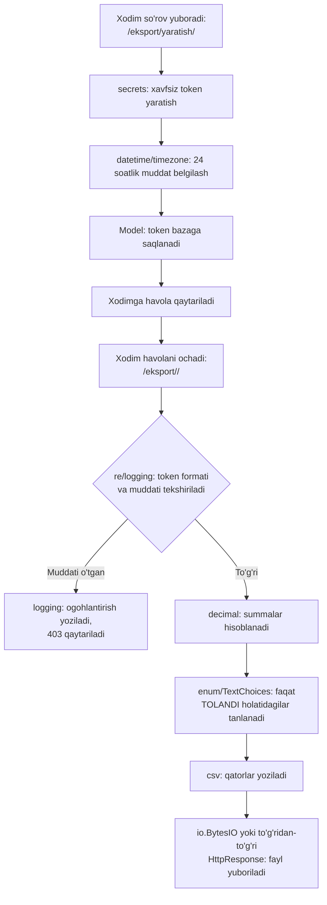

# 9.1. `onlayn_dokon`ga xavfsiz eksport funksiyasini qo'shish — barcha modullar birlashadi

## Bu darsda nimalarni o'rganasiz

- Kurs davomida ko'rilgan barcha modullarni (bittasi ham chetda qolmasdan) bitta real vazifada birlashtirishni ko'rasiz
- Ko'p qatlamli funksionallikni kichik, alohida test qilinadigan qismlarga qanday bo'lishni o'rganasiz
- To'liq, ishlaydigan "buyurtmalarni xavfsiz eksport qilish" funksiyasini qadam-baqadam qurasiz

## Nazariy qism

### Vazifa: "Buyurtmalarni xavfsiz eksport qilish"

`onlayn_dokon` do'kon egasi har oyning oxirida barcha to'langan buyurtmalarni CSV formatida yuklab olishi, va bu yuklab olish havolasini xodimlar bilan (masalan Telegram orqali) bo'lishishi kerak — lekin havola **faqat 24 soat davomida amal qilishi**, va uni faqat oldindan bilingan token bilan ochish mumkin bo'lishi kerak (URL'ni taxmin qilib topib bo'lmasin).

Bu bitta vazifa, lekin uni yechish uchun 9 ta bobda ko'rilgan deyarli **barcha** modul kerak bo'ladi:



### Nega bunday bo'lib-bo'lib qurish kerak

Katta funksionallikni bittada, bitta uzun funksiya sifatida yozish — xatoni topishni qiyinlashtiradi va test qilib bo'lmaydi. Shuning uchun vazifani mustaqil qismlarga ajratamiz: (1) token yaratish va saqlash, (2) tokenni tekshirish, (3) ma'lumotni CSV'ga aylantirish. Har bir qism — alohida funksiya, alohida sinalishi mumkin.

## Amaliy misol

### 1-qism: Eksport so'rovi modeli (`secrets`, `datetime`/`timezone`, `uuid`)

```python
# apps/hisobotlar/models.py
import secrets
from datetime import timedelta

from django.db import models
from django.utils import timezone


class EksportSorovi(models.Model):
    token = models.CharField(max_length=64, unique=True, editable=False)
    yaratilgan_vaqt = models.DateTimeField(auto_now_add=True)
    yaratuvchi = models.ForeignKey("auth.User", on_delete=models.CASCADE)
    ishlatilganmi = models.BooleanField(default=False)

    def save(self, *args, **kwargs):
        if not self.token:
            self.token = secrets.token_urlsafe(32)   # 5.1-dars
        super().save(*args, **kwargs)

    def amal_qiladimi(self):
        muddat_tugagan = timezone.now() > self.yaratilgan_vaqt + timedelta(hours=24)  # 2.1-dars
        return not self.ishlatilganmi and not muddat_tugagan
```

### 2-qism: So'rov yaratuvchi view (`logging`)

```python
# apps/hisobotlar/views.py
import logging

from django.contrib.auth.decorators import staff_member_required
from django.http import JsonResponse

from .models import EksportSorovi

logger = logging.getLogger(__name__)   # 7.1-dars


@staff_member_required
def eksport_sorovi_yaratish(request):
    sorov = EksportSorovi.objects.create(yaratuvchi=request.user)
    logger.info("Eksport so'rovi yaratildi: xodim=%s, token=%s...", request.user, sorov.token[:8])

    havola = request.build_absolute_uri(f"/eksport/{sorov.token}/")
    return JsonResponse({"havola": havola, "amal_qilish_muddati": "24 soat"})
```

### 3-qism: Eksportni yuklab olish (`decimal`, `enum`/`TextChoices`, `csv`, `logging`)

```python
# apps/hisobotlar/views.py (davomi)
import csv
from decimal import Decimal

from django.http import HttpResponse, HttpResponseForbidden

from apps.buyurtmalar.models import Buyurtma


def eksportni_yuklab_olish(request, token):
    try:
        sorov = EksportSorovi.objects.get(token=token)   # 3.1-darsdagi kabi, formatni re bilan
    except EksportSorovi.DoesNotExist:                    # ham tekshirish mumkin, bu yerda ORM yetarli
        logger.warning("Eksport: mavjud bo'lmagan token bilan urinish")
        return HttpResponseForbidden("Havola noto'g'ri")

    if not sorov.amal_qiladimi():
        logger.warning("Eksport: muddati o'tgan yoki ishlatilgan token, id=%s", sorov.id)
        return HttpResponseForbidden("Havola muddati o'tgan yoki allaqachon ishlatilgan")

    response = HttpResponse(content_type="text/csv")     # 4.2-dars
    response["Content-Disposition"] = 'attachment; filename="buyurtmalar-eksport.csv"'

    writer = csv.writer(response)
    writer.writerow(["ID", "Mijoz", "Holat", "Summa", "Sana"])

    buyurtmalar = (
        Buyurtma.objects.filter(holat=Buyurtma.Holat.TOLANDI)   # 4.2-darsdagi TextChoices
        .select_related("mijoz")
        .order_by("-yaratilgan_sana")
    )

    jami_summa = Decimal("0.00")   # 3.2-dars
    for b in buyurtmalar:
        writer.writerow([
            b.id, b.mijoz.toliq_ism, b.get_holat_display(),
            b.umumiy_summa, b.yaratilgan_sana.strftime("%Y-%m-%d %H:%M"),
        ])
        jami_summa += b.umumiy_summa

    writer.writerow([])
    writer.writerow(["JAMI:", "", "", jami_summa, ""])

    sorov.ishlatilganmi = True
    sorov.save(update_fields=["ishlatilganmi"])

    logger.info("Eksport muvaffaqiyatli yuklab olindi: token=%s..., %s ta buyurtma", token[:8], buyurtmalar.count())

    return response
```

### 4-qism: Eski eksport so'rovlarini tozalash (`pathlib` o'rniga bu yerda faqat ORM, lekin `argparse`/management command mantiqi)

```python
# apps/hisobotlar/management/commands/eski_eksportlarni_tozalash.py
from datetime import timedelta

from django.core.management.base import BaseCommand
from django.utils import timezone

from apps.hisobotlar.models import EksportSorovi


class Command(BaseCommand):
    help = "7 kundan eski EksportSorovi yozuvlarini o'chiradi"

    def add_arguments(self, parser):        # 8.1-dars
        parser.add_argument("--kunlar", type=int, default=7)

    def handle(self, *args, **options):
        chegara = timezone.now() - timedelta(days=options["kunlar"])
        ochirilgan, _ = EksportSorovi.objects.filter(yaratilgan_vaqt__lt=chegara).delete()
        self.stdout.write(self.style.SUCCESS(f"{ochirilgan} ta eski eksport so'rovi o'chirildi"))
```

## Keng tarqalgan xatolar

**Xato 1:** Vazifani bittada, bo'linmagan holda yozish.

❌ Butun logikani (token yaratish, tekshirish, CSV yozish) bitta 100+ qatorli view funksiyasiga joylash — o'qish, test qilish va xato topish qiyinlashadi.

✅ Yuqoridagi kabi, har bir mas'uliyatni (token yaratish, tekshirish, eksport) alohida funksiya/view'ga bo'ling — har biri o'z modulini ishlatadi, va mustaqil o'zgartirilishi mumkin.

**Xato 2:** Har bir bobda ko'rilgan "keng tarqalgan xato"larni yakuniy loyihada takrorlash.

❌ Masalan `EksportSorovi.token`ni `default=secrets.token_urlsafe(32)` (qavs bilan, 3.2-darsdagi `uuid.uuid4()` xatosiga o'xshash) deb yozish — barcha yozuvlar bitta xil tokenga ega bo'lib qoladi.

✅ Har bir bobning "Keng tarqalgan xatolar" bo'limini yakuniy loyihaga o'tishdan oldin qayta ko'rib chiqing — bu darslikning maqsadi aynan shu: bilimni **eslab qolish**, nafaqat bir marta o'qish.

**Xato 3:** Logging'ni faqat xato yuz berganda emas, muvaffaqiyatli holatlarda ham yozmaslik.

❌ Faqat `logger.warning(...)`/`logger.error(...)` yozib, muvaffaqiyatli eksport haqida hech qanday log qoldirmaslik — keyinchalik "bu eksport kim tomonidan, qachon yuklab olingan" degan savolga javob topib bo'lmaydi.

✅ Muhim, audit talab qiladigan amallar (kim eksport yaratdi, kim yukladi) uchun **muvaffaqiyatli** holatda ham `logger.info(...)` yozing — yuqoridagi amaliy misoldagi kabi.

## Mashq/topshiriq

**(Oson)** `EksportSorovi` modeli uchun Django admin ro'yxatini (`admin.py`) yozing — `list_display`da `token` (faqat birinchi 8 belgisini ko'rsatuvchi metod bilan, to'liq tokenni admin panelda ochiq ko'rsatmaslik xavfsizlik nuqtai nazaridan yaxshiroq), `yaratuvchi`, `yaratilgan_vaqt`, `ishlatilganmi` bo'lsin.

**(O'rtacha)** `eksportni_yuklab_olish` view'iga, agar `Buyurtma.Holat.TOLANDI` holatidagi buyurtmalar umuman bo'lmasa, CSV o'rniga oddiy xabar (`"Eksport qilinadigan ma'lumot yo'q"`) bilan `HttpResponse` qaytaradigan shart qo'shing.

**(Qiyin)** Butun oqimni (so'rov yaratish → havola olish → eksportni yuklab olish → ikkinchi marta urinish muvaffaqiyatsiz bo'lishi kerak, chunki `ishlatilganmi=True`) Django'ning `TestCase`i bilan sinovdan o'tkazuvchi test yozing (`apps/hisobotlar/tests.py`). Eslatma: bu standart kutubxonaning `unittest`iga asoslangan — README.md'da aytilganidek, alohida chuqur ko'rilmagan, lekin Django'ning o'z test darsligida batafsil o'rganilgan.

<details>
<summary>Javoblarni ko'rish</summary>

1.
```python
# apps/hisobotlar/admin.py
from django.contrib import admin

from .models import EksportSorovi


@admin.register(EksportSorovi)
class EksportSoroviAdmin(admin.ModelAdmin):
    list_display = ["token_qisqa", "yaratuvchi", "yaratilgan_vaqt", "ishlatilganmi"]

    def token_qisqa(self, obj):
        return f"{obj.token[:8]}..."
    token_qisqa.short_description = "Token"
```

2.
```python
buyurtmalar = (
    Buyurtma.objects.filter(holat=Buyurtma.Holat.TOLANDI)
    .select_related("mijoz")
    .order_by("-yaratilgan_sana")
)

if not buyurtmalar.exists():
    return HttpResponse("Eksport qilinadigan ma'lumot yo'q", content_type="text/plain")

# ... qolgan CSV yozish mantiqi
```

3.
```python
from django.contrib.auth.models import User
from django.test import TestCase

from .models import EksportSorovi


class EksportOqimiTest(TestCase):
    def setUp(self):
        self.xodim = User.objects.create_user("xodim1", password="parol123", is_staff=True)

    def test_eksport_faqat_bir_marta_ishlatiladi(self):
        self.client.force_login(self.xodim)

        javob = self.client.post("/eksport/yaratish/")
        havola = javob.json()["havola"]
        token = havola.rstrip("/").split("/")[-1]

        birinchi = self.client.get(f"/eksport/{token}/")
        self.assertEqual(birinchi.status_code, 200)

        ikkinchi = self.client.get(f"/eksport/{token}/")
        self.assertEqual(ikkinchi.status_code, 403)
```

</details>

## Qisqacha xulosa

Bu dars — 0.1-darsdan boshlangan barcha modullarning (`secrets`, `datetime`, `decimal`, `enum`, `csv`, `logging`, `argparse`) real, ishlaydigan vazifada birga ishlashini ko'rsatdi: xavfsiz, muddati cheklangan, bir martalik eksport havolasi. Muhim xulosa — bu modullarning hech biri alohida "murakkab" emas, lekin ularni **to'g'ri kombinatsiyada** ishlatish real production darajadagi funksionallik yaratadi. Keyingi, yakuniy darsda — butun kursni umumlashtiruvchi cheklist va "qaysi vazifada qaysi modulni eslash kerak" xarita bilan yakunlaymiz.
