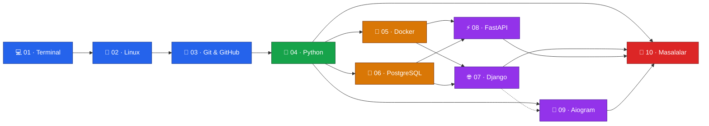

<div align="center">

# 📚 TUTORIAL

### Dasturlash darsliklari — noldan production darajasigacha

O'zbek tilida yozilgan, bir-biriga bog'langan **10 modul** va **380+ dars**.<br/>
Terminalda birinchi buyruqdan — serverga chiqarilgan Telegram botgacha.

<br/>


<br/>

[**Boshlash**](#-oquv-yonalishi) &nbsp;·&nbsp; [**Modullar**](#-modullar) &nbsp;·&nbsp; [**Arxitektura**](docs/ARCHITECTURE.md) &nbsp;·&nbsp; [**Dars formati**](#-har-bir-dars-qanday-tuzilgan)

</div>

---

## 🗺 O'quv yo'nalishi

Modullar tasodifiy tartibda emas — har biri oldingisining ustiga quriladi:



<div align="center">
<sub>Uzluksiz chiziq — kerakli bilim · Nuqtali chiziq — tavsiya etiladi, shart emas</sub>
</div>

---

## 📦 Modullar

| | Modul | Bo'lim | Dars | Nimani o'rganasiz |
|:-:|:---|:-:|:-:|:---|
| 💻 | **[Terminal](01-Terminal/)** | 14 | 30 | Fayl tizimi, qidiruv, pipeline, bash skript, SSH, xavfsizlik |
| 🐧 | **[Linux](02-Linux/)** | 7 | 28 | Ruxsatlar, jarayonlar, APT, systemd/cron, tarmoq va UFW |
| 🌿 | **[Git & GitHub](03-Git-GitHub/)** | 7 | 20 | Branch/merge, rebase, PR va code review, GitHub Actions |
| 🐍 | **[Python](04-Python/)** | 15 | 57 | Sintaksisdan CPython ichki mexanizmlari, GIL va C API gacha |
| 🐳 | **[Docker](05-Docker/)** | 7 | 18 | Image/konteyner, Dockerfile, Compose, multi-stage, xavfsizlik |
| 🐘 | **[PostgreSQL](06-PostgreSQL/)** | 31 | 95 | SELECT'dan MVCC, WAL, query planner va replikatsiyagacha |
| 🌐 | **[Django](07-Django/)** | 6 qism | 95 | Asosiy kurs · bot integratsiya · kod o'qish · kutubxonalar · std-lib |
| ⚡ | **[FastAPI](08-FastAPI/)** | 8 + amaliy | 32 | Pydantic, DI, async DB, JWT, WebSocket, Redis, Docker, Blog API deploy |
| 🤖 | **[Aiogram](09-Aiogram/)** | — | 18 | Telegram bot: handler, FSM, middleware, webhook, To-Do bot |
| 🧩 | **[Masalalar](10-Masalalar/)** | 2 til | 320+ | Python va TypeScript amaliy masalalari va yechimlari |

> Har bir modul papkasiga kirsangiz — o'sha modulning to'liq mundarijasi darhol ochiladi.

---

## 📖 Har bir dars qanday tuzilgan

Barcha darslar bir xil tuzilmaga ega — shuning uchun istalgan darsni ochganda nima kutishni bilasiz:

```
🎯  Bu darsda nimalarni o'rganasiz
📘  Nazariy qism            — tushuntirish + kod misollari
🛠  Amaliy misol            — real loyihada qo'llanishi
⚠️  Keng tarqalgan xatolar   — ❌ noto'g'ri / ✅ to'g'ri + SABAB
✍️  Mashq                   — Oson / O'rtacha / Qiyin (javoblari bilan)
📌  Qisqacha xulosa
```

---

## 🚀 Qanday boshlash

```bash
git clone https://github.com/shamsiyevshamsiddin19/TUTORIAl.git
cd TUTORIAl
```

1. Yuqoridagi **[o'quv yo'nalishi](#-oquv-yonalishi)** grafigiga qarang — qaysi moduldan boshlashni tanlang.
2. Modul papkasini oching — mundarija avtomatik ko'rinadi.
3. Darslarni tartib bilan o'qing, har darsning oxiridagi mashqlarni albatta yeching.
4. Modulni tugatgach **[🧩 Masalalar](10-Masalalar/)** ga qaytib, amaliyot qiling.

> 💡 Markdown fayllarni eng qulay o'qish uchun: GitHub'da to'g'ridan-to'g'ri, yoki VS Code / Obsidian orqali.

---

## 🏗 Arxitektura

Papka va fayllar qanday tashkil etilgani, nomlash qoidalari va yangi modul qo'shish tartibi — **[docs/ARCHITECTURE.md](docs/ARCHITECTURE.md)** da to'liq graf ko'rinishida.

```
TUTORIAl/
├── 01-Terminal/          ← NN- prefiks = o'qish tartibi
│   ├── README.md         ← modul mundarijasi (avtomatik ko'rinadi)
│   ├── 00-bob-kirish/
│   └── 01-bob-fayl-tizimi/
│       ├── 1.1-papkalar-orasida-yurish.md
│       └── 1.2-fayl-va-papkalarni-korish-yaratish.md
├── ...
└── docs/ARCHITECTURE.md
```

---

<div align="center">
<sub>Muallif: <a href="https://github.com/shamsiyevshamsiddin19">Shamsiddin Shamsiyev</a></sub>
</div>
