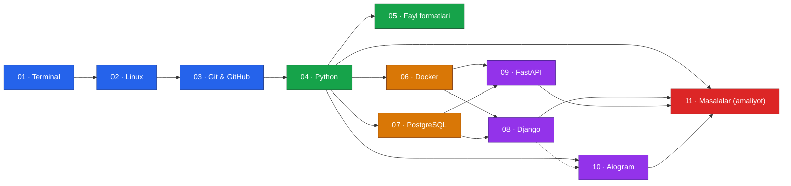
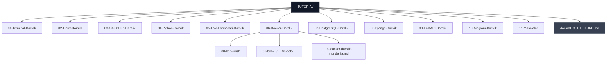

# 📚 TUTORIAL — Dasturlash darsliklari to'plami

O'zbek tilida yozilgan, noldan production darajasigacha boradigan dasturlash darsliklari to'plami. Har bir modul mustaqil o'qish uchun tayyor: nazariya, amaliy misollar, keng tarqalgan xatolar va mashqlar bilan.

> 11 ta modul · 400+ dars fayli · Terminal'dan Telegram bot production'gacha bo'lgan to'liq yo'l

## Mundarija

- [O'quv yo'nalishi (graph)](#oquv-yonalishi)
- [Modullar ro'yxati](#modullar-royxati)
- [Repozitoriy arxitekturasi](#repozitoriy-arxitekturasi)
- [Har bir modul ichidagi tuzilma](#har-bir-modul-ichidagi-tuzilma)
- [Qanday foydalanish kerak](#qanday-foydalanish-kerak)

## O'quv yo'nalishi

Modullar orasidagi tavsiya etilgan o'tish tartibi va bog'liqlik (prerequisite) grafigi:



Uzluksiz chiziq — qat'iy talab qilinadigan bilim; nuqtali chiziq — tavsiya etiladigan (lekin majburiy bo'lmagan) bog'liqlik.

## Modullar ro'yxati

| № | Modul | Papka | Dars fayllari | Qisqacha mazmun |
|---|---|---|---|---|
| 01 | Terminal | [`01-Terminal-Darslik/`](01-Terminal-Darslik) | 31 | Fayl tizimi, pipeline, bash skript, SSH, xavfsizlik |
| 02 | Linux | [`02-Linux-Darslik/`](02-Linux-Darslik) | 29 | Ruxsatlar, jarayonlar, systemd/cron, tarmoq va SSH |
| 03 | Git & GitHub | [`03-Git-GitHub-Darslik/`](03-Git-GitHub-Darslik) | 21 | Branch/merge, hamkorlikda ishlash, CI/CD, real loyiha |
| 04 | Python | [`04-Python-Darslik/`](04-Python-Darslik) | 58 | Sintaksisdan GIL, C API va performance'gacha chuqur kurs |
| 05 | Fayl formatlari | [`05-Fayl-Formatlari-Darslik/`](05-Fayl-Formatlari-Darslik) | 25 | Matn, jadval, rasm, video, arxiv, ma'lumotlar bazasi formatlari |
| 06 | Docker | [`06-Docker-Darslik/`](06-Docker-Darslik) | 19 | Image/konteyner, Dockerfile, compose, xavfsizlik |
| 07 | PostgreSQL | [`07-PostgreSQL-Darslik/`](07-PostgreSQL-Darslik) | 96 | DDL/DML dan WAL, query planner, xavfsizlikkacha |
| 08 | Django | [`08-Django-Darslik/`](08-Django-Darslik) | 100 | 6 qism: asosiy kurs → bot integratsiya → kod o'qish → kutubxonalar → std-lib → konspektlar |
| 09 | FastAPI | [`09-FastAPI-Darslik/`](09-FastAPI-Darslik) | 23 | Pydantic, routing/DI, autentifikatsiya, production deploy |
| 10 | Aiogram | [`10-Aiogram-Darslik/`](10-Aiogram-Darslik) | 19 | Telegram bot: FSM, middleware, webhook, yakuniy To-Do bot |
| 11 | Masalalar | [`11-Masalalar/`](11-Masalalar) | — | Python, TypeScript amaliy masala yechimlari |

To'liq mavzular ro'yxati uchun har bir modul papkasidagi `00-*-mundarija.md` (yoki `00-MUNDARIJA.md`) faylini oching.

## Repozitoriy arxitekturasi

Papkalar va fayllar qanday tashkil etilgani (batafsili, to'liq daraxt grafigi uchun [`docs/ARCHITECTURE.md`](docs/ARCHITECTURE.md) ga qarang):



## Har bir modul ichidagi tuzilma

Ko'pchilik modullar bir xil naqshga amal qiladi:

```
NN-Nomi-Darslik/
├── 00-nomi-darslik-mundarija.md   ← modulning to'liq mundarijasi (TOC)
├── 00-bob-kirish/                 ← kirish bobi
├── 01-bob-.../                    ← mavzu bo'yicha boblar (chapters)
│   ├── 1.1-mavzu.md
│   └── 1.2-mavzu.md
└── ...
```

- Har bir dars: **nazariya → amaliy misol → keng tarqalgan xatolar (❌/✅) → mashq/topshiriq → xulosa** tuzilmasiga ega.
- Har bir modulning boshida `00-*-mundarija.md` fayli — o'sha modulning to'liq mavzular jadvali.

## Qanday foydalanish kerak

1. Modullarni [O'quv yo'nalishi](#oquv-yonalishi) grafigidagi tartibda o'qing (yoki allaqachon bilgan mavzularingizni o'tkazib yuboring).
2. Har bir modulga kirishdan oldin uning `00-*-mundarija.md` faylini o'qib chiqing.
3. `11-Masalalar/` papkasidagi amaliy masalalarni tegishli modulni o'rgangach yeching.

```bash
git clone https://github.com/shamsiyevshamsiddin19/TUTORIAl.git
cd TUTORIAl
```
