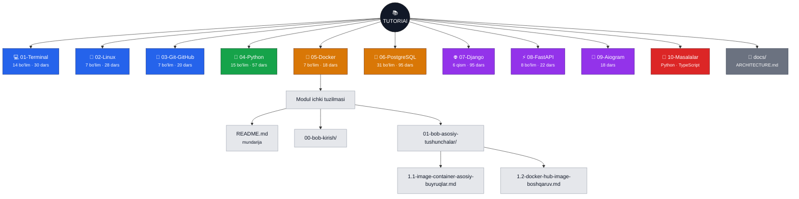
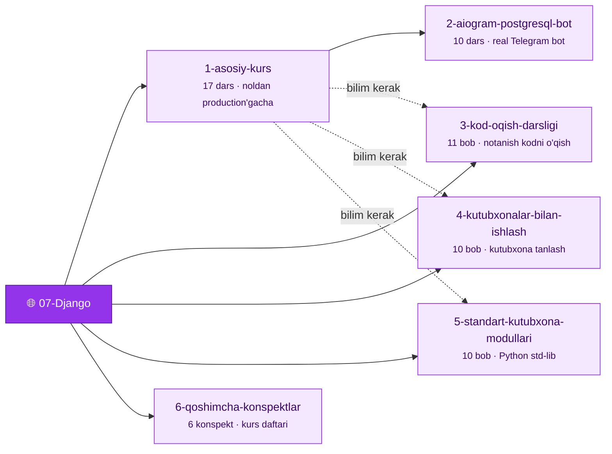

<div align="center">

# 🏗 Arxitektura

Repozitoriyning papka/fayl tuzilmasi, nomlash qoidalari va kengaytirish tartibi

<sub>[🏠 Bosh sahifa](../README.md)</sub>

</div>

---

## 1. Nomlash qoidalari

| Qoida | Misol | Nega shunday |
|---|---|---|
| Tub papka: `NN-Nom` | `04-Python` | Raqam — o'qish tartibi. Fayl tizimi va GitHub ikkalasida ham to'g'ri tartibda ko'rinadi |
| Modul mundarijasi: `README.md` | `04-Python/README.md` | GitHub papkaga kirilganda uni avtomatik ko'rsatadi — qidirib o'tirish shart emas |
| Bo'lim papkasi: `NN-bob-nom` | `01-bob-fayl-tizimi` | Bo'limlar ham raqamli tartibda; "bob" so'zi dars fayllaridan ajratib turadi |
| Dars fayli: `N.M-mavzu.md` | `1.2-fayl-va-papkalarni-korish-yaratish.md` | `bo'lim.dars` raqami — mundarijadagi raqam bilan bir xil |
| Faqat kichik harf, defis | `06-bob-tarmoq-ssh-xavfsizlik` | Bo'sh joy va maxsus belgilarsiz — URL va terminalda muammosiz |

**Asosiy tamoyillar:**

1. **Har bir modul mustaqil** — ichidagi fayllar modulni tushunish uchun yetarli. Modullararo bog'liqlik faqat mantiqiy (Django uchun Python bilimi kerak), texnik emas.
2. **README — yagona kirish nuqtasi** — istalgan papkaga kirganda nima borligini darhol ko'rasiz.
3. **Bir xil dars tuzilmasi** — barcha 380+ dars bir xil ichki formatda (4-bo'limga qarang).

---

## 2. To'liq papka daraxti



---

## 3. Django moduli — "modul ichida modul"

`07-Django/` boshqalardan farq qiladi: u 6 ta mustaqil kichik-darslikdan iborat, shuning uchun bo'lim emas, **qism** darajasiga ega:



`1-asosiy-kurs` → `2-aiogram-postgresql-bot` ketma-ket o'qiladi. Qolgan 4 qism bir-biridan mustaqil — asoslarni o'zlashtirgach istalgan tartibda.

---

## 4. Dars faylining ichki tuzilmasi

Barcha dars fayllari bir xil skeletga ega:

```markdown
# Sarlavha

## Bu darsda nimalarni o'rganasiz     ← 3-5 punkt, kutilgan natija
## Nazariy qism                       ← tushuntirish + kod misollari
## Amaliy misol                       ← real loyihada qo'llanishi
## Keng tarqalgan xatolar             ← ❌ noto'g'ri / ✅ to'g'ri + SABAB
## Mashq                              ← Oson / O'rtacha / Qiyin + javob kaliti
## Qisqacha xulosa

---
- Oldingi dars: [...](../NN-bob-.../N.M-....md)
- Keyingi dars: [...](../NN-bob-.../N.M-....md)
```

Oxiridagi **oldingi/keyingi** havolalari darslarni bog'lab, uzluksiz o'qish imkonini beradi.

---

## 5. `10-Masalalar/` — amaliyot qismi

Masalalar modullardan ajratilgan, chunki ular bir nechta tilga tegishli va istalgan modulni tugatgach qaytib kelish uchun mo'ljallangan:

```
10-Masalalar/
├── README.md
├── Python/
│   ├── Masalalar/Modul 1/
│   │   ├── Masala fayl/                     ← masalalar to'plami (PDF)
│   │   └── Tanlangan masalalar yechimlari/  ← masala_001.py … (60 ta)
│   ├── Masalalar/Modul 2/                   ← (66 ta yechim)
│   └── o'rganish jarayoni/
└── TS/
    └── Modul 1/Masala N/
        ├── index.html
        ├── main.css
        ├── script.ts
        └── script.js
```

---

## 6. Yangi modul qo'shish

```bash
# 1. Keyingi bo'sh raqam bilan papka
mkdir 11-Yangi-Mavzu

# 2. Mundarija (GitHub avtomatik ko'rsatadi)
touch 11-Yangi-Mavzu/README.md

# 3. Bo'limlar va darslar
mkdir 11-Yangi-Mavzu/01-bob-asoslar
touch 11-Yangi-Mavzu/01-bob-asoslar/1.1-birinchi-dars.md
```

So'ngra:

- `11-Yangi-Mavzu/README.md` ga markazlashtirilgan header, statistika va oldingi/keyingi navigatsiyani qo'shing (boshqa modullardan nusxa oling).
- Ildizdagi [`README.md`](../README.md) dagi **Modullar** jadvaliga va **o'quv yo'nalishi** grafigiga yangi modulni kiriting.
- Shu faylning 2-bo'limidagi daraxt grafigiga tugun qo'shing.
