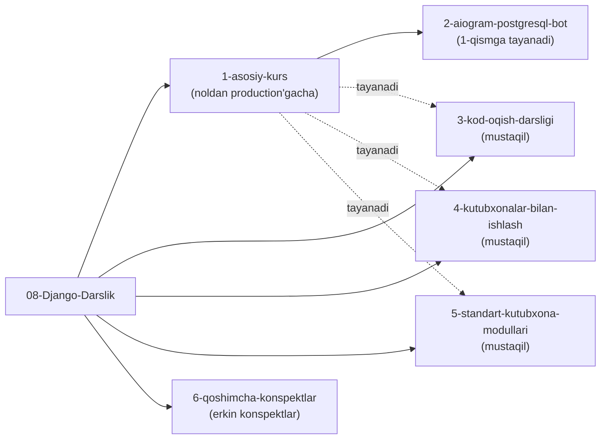

# Arxitektura

Bu hujjat repozitoriyning to'liq papka/fayl arxitekturasini va tashkiliy tamoyillarini tasvirlaydi.

## 1. Tashkiliy tamoyillar

1. **Raqamli prefiks = o'qish tartibi.** Har bir tub papka `NN-` bilan boshlanadi (`01-…` dan `11-…` gacha) — bu papkalarni fayl tizimida ham, GitHub'da ham tavsiya etilgan o'qish tartibida saqlaydi.
2. **Har bir modul mustaqil.** Modul ichidagi barcha fayllar shu modulni tushunish uchun yetarli; boshqa modulga qattiq bog'liqlik yo'q (faqat mantiqiy prerequisite — masalan Django uchun Python bilimi).
3. **Mundarija — yagona kirish nuqtasi.** Har bir modulning ildizida `00-*-mundarija.md` (yoki `00-MUNDARIJA.md`) fayli bor — o'sha modulning to'liq xaritasi.
4. **Bob (chapter) → dars (lesson) ierarxiyasi.** Ko'p qismli modullar `NN-bob-nomi/` papkalarga, ular esa `N.M-mavzu.md` darslarga bo'linadi.

## 2. To'liq papka daraxti (graf ko'rinishida)

```mermaid
flowchart TD
    ROOT(("TUTORIAl/"))

    ROOT --> M01["01-Terminal-Darslik"]
    M01 --> M01B["00-bob-kirish … 13-bob-yakuniy-loyiha<br/>(14 bob, 31 dars)"]

    ROOT --> M02["02-Linux-Darslik"]
    M02 --> M02B["00-bob-kirish … 06-bob-tarmoq-ssh-xavfsizlik<br/>(7 bob, 29 dars)"]

    ROOT --> M03["03-Git-GitHub-Darslik"]
    M03 --> M03B["00-bob-kirish … 06-bob-real-loyiha<br/>(7 bob, 21 dars)"]

    ROOT --> M04["04-Python-Darslik"]
    M04 --> M04B["00-bob-kirish … 14-bob-c-api<br/>(15 bob, 58 dars)"]

    ROOT --> M05["05-Fayl-Formatlari-Darslik"]
    M05 --> M05B["00-bob-kirish … 19-bob-xulosa<br/>(20 bob, 25 dars)"]

    ROOT --> M06["06-Docker-Darslik"]
    M06 --> M06B["00-bob-kirish … 06-bob-ilgor-mavzular<br/>(7 bob, 19 dars)"]

    ROOT --> M07["07-PostgreSQL-Darslik"]
    M07 --> M07B["00-bob-kirish-ornatish … 24-ilova-toliq-baza-skripti<br/>(25 bob, 96 dars)"]

    ROOT --> M08["08-Django-Darslik"]
    M08 --> M08a["1-asosiy-kurs (17 dars)"]
    M08 --> M08b["2-aiogram-postgresql-bot (10 dars)"]
    M08 --> M08c["3-kod-oqish-darsligi (11 bob)"]
    M08 --> M08d["4-kutubxonalar-bilan-ishlash (10 bob)"]
    M08 --> M08e["5-standart-kutubxona-modullari (10 bob)"]
    M08 --> M08f["6-qoshimcha-konspektlar (6 konspekt)"]

    ROOT --> M09["09-FastAPI-Darslik"]
    M09 --> M09B["00-bob-kirish … 07-bob-production-deploy<br/>(8 bob, 23 dars)"]

    ROOT --> M10["10-Aiogram-Darslik"]
    M10 --> M10B["01 … 18 (flat, 19 dars)"]

    ROOT --> M11["11-Masalalar"]
    M11 --> M11a["Python/ (masala fayllari + yechimlar)"]
    M11 --> M11b["TS/ (Modul 1, Modul 2 — html/css/js/ts)"]

    ROOT --> DOC["docs/ARCHITECTURE.md (shu fayl)"]
    ROOT --> RM["README.md"]

    classDef mod fill:#1f2937,stroke:#111827,color:#fff
    classDef leaf fill:#e5e7eb,stroke:#9ca3af,color:#111827
    class M01,M02,M03,M04,M05,M06,M07,M08,M09,M10,M11 mod
    class M01B,M02B,M03B,M04B,M05B,M06B,M07B,M08a,M08b,M08c,M08d,M08e,M08f,M09B,M10B,M11a,M11b leaf
```



## 3. Django modulining ichki arxitekturasi (misol)

`08-Django-Darslik/` boshqa modullardan farqli — u 6 ta mustaqil kichik-darslikdan iborat "modul ichida modul" arxitekturasiga ega:



## 4. Dars fayli formati

Har bir `.md` dars fayli quyidagi bir xil ichki tuzilmaga amal qiladi:

```
# Sarlavha

## Bu darsda nimalarni o'rganasiz
## Nazariy qism
## Amaliy misol
## Keng tarqalgan xatolar (❌ / ✅ + SABAB)
## Mashq / topshiriq (Oson / O'rtacha / Qiyin)
## Qisqacha xulosa
```

Bu bir xillik har qanday darsni bir xil kutish bilan o'qishni osonlashtiradi va yangi darslar qo'shishda namuna sifatida xizmat qiladi.

## 5. `11-Masalalar/` arxitekturasi

Amaliy masalalar modullardan ajratilgan holda saqlanadi, chunki ular ko'p tilga (Python, TypeScript) tegishli va istalgan modulni o'rgangandan keyin qaytib kelib yechish mumkin:

```
11-Masalalar/
├── Python/
│   ├── Masalalar/Modul 1/{Masala fayl, Tanlangan masalalar yechimlari}/
│   ├── Masalalar/Modul 2/{Masala fayl, Tanlangan masalalar yechimlari}/
│   └── o'rganish jarayoni/
└── TS/
    ├── Modul 1/Masala 1 … Masala N/{index.html, main.css, script.js, script.ts}
    └── Modul 2/...
```

## 6. Yangi modul qo'shish qoidasi

Kelajakda yangi darslik qo'shilganda:

1. Repo ildiziga keyingi bo'sh raqam bilan `NN-Nomi-Darslik/` papka oching.
2. Ichiga `00-nomi-darslik-mundarija.md` yozing.
3. Mavzularni `NN-bob-nomi/` papkalarga, darslarni `N.M-mavzu.md` fayllarga bo'ling.
4. Ildizdagi [`README.md`](../README.md) dagi jadval va grafga yangi modulni qo'shing.
